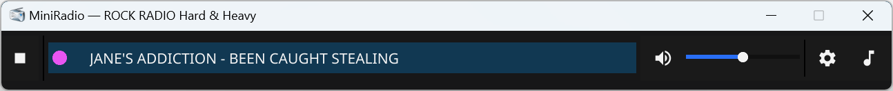
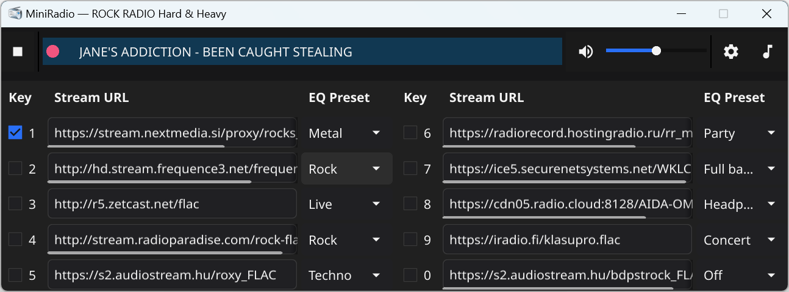
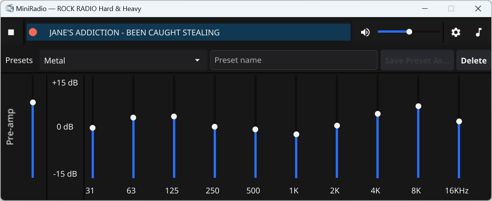

# MiniRadio (Go + Fyne + libVLC)

MiniRadio is a compact cross-platform internet-radio client built with Go, Fyne, and libVLC.  
It provides a minimal horizontal UI (~800×32), fast preset switching, an equalizer, and a dark theme.

Primary target: **Windows x64**, but it also runs on Linux and macOS when libVLC is available.

---

## Screenshots

Main (player) window<p>


Expandable Settings Pane (stations configuration)<p>


Embedded per-station dedicated Equalizer<p>


---

## Features

- Slim horizontal UI: Play/Stop, Mute, Volume −/+, Settings, Equalizer
- Scrolling “Now Playing” ticker (ICY / JSON / Sibling — best effort)
- **10 radio presets** (slots 1…9 and 0)
- **Keyboard shortcuts:**
    - `1…9` — switch to preset 1–9
    - `0` — preset #10
    - `Space` — Play / Stop
    - `+` / `-` — Volume Up / Down
    - `*` — Mute / Unmute
- JSON configuration stored in the user config directory
- Built-in equalizer presets + support for custom presets
- Optional Radio Browser integration for station lookup

---

## Obtaining radio stream URLs

MiniRadio does not include a built-in station directory.  
Users supply the actual streaming URLs themselves.

Recommended source:

### **Radio Browser**
https://www.radio-browser.info  

Steps:

1. Open the Radio Browser website
2. Search for a station
3. Open the station details
4. Copy the real stream URL (`url_resolved`)
5. Paste it into one of the 10 MiniRadio presets (via Settings)

---

## Switching between stations

You can switch stations in two ways:

### **1. Hotkeys**
- `1` → preset #1
- `2` → preset #2
- …
- `9` → preset #9
- `0` → preset #10

### **2. Settings window**
In the Settings panel you will find 10 radio buttons — one per preset.

---

## Requirements

- **Go 1.22+**
- **GUI framework:** `fyne.io/fyne/v2`
- **VLC binding:** `github.com/adrg/libvlc-go/v3`
- **Runtime requirement:** libVLC shared libraries must be available next to `miniradio.exe`
    - `libvlc.dll`
    - `libvlccore.dll`
    - `plugins/` directory

---

## libVLC for Windows

Place the following files next to `miniradio.exe`:

miniradio.exe
libvlc.dll
libvlccore.dll
plugins/

You can obtain these DLLs by:

1. Downloading the official VLC SDK  
   https://download.videolan.org/pub/videolan/vlc/

2. Copying DLLs from an installed VLC player  
   `<Program Files>\VideoLAN\VLC\`

3. Building VLC from source (optional — advanced)

---

## Minimal VLC plugin set

MiniRadio requires only audio streaming support.  
A reduced set of plugins is sufficient:

```text
plugins/access/libhttp_plugin.dll
plugins/access/libhttps_plugin.dll
plugins/access/libudp_plugin.dll
plugins/demux/libplaylist_plugin.dll
plugins/demux/libasf_plugin.dll
plugins/demux/libogg_plugin.dll
plugins/codec/libfaad_plugin.dll
plugins/codec/libmpg123_plugin.dll
plugins/codec/libvorbis_plugin.dll
plugins/audio_output/libdirectsound_plugin.dll
plugins/audio_filter/libequalizer_plugin.dll
plugins/misc/liblogger_plugin.dll
plugins/stream_filter/libstream_filter_record_plugin.dll
```
You may also ship the full `plugins/` directory.

---

## Equalizer & Preamp basics


MiniRadio includes a simple **graphic equalizer** and a **preamp** control.
If you’ve never used an equalizer before, here’s the short description.

### What is an equalizer?

An **equalizer (EQ)** lets you boost or reduce specific ranges of audio frequencies. 
Instead of a single “loud/quiet” volume control, you get multiple “sliders” for different parts of the sound:

- **Low frequencies** (bass) – kick drums, bass guitars, low synths, rumble
- **Mid frequencies** (mids) – most vocals, guitars, pianos, podcasts
- **High frequencies** (treble) – cymbals, “air”, sibilants, detail

By moving EQ sliders up/down, you’re telling the player:

> “Give me *more* of this range, *less* of that range.”

This is useful because different:
- music genres,
- speakers / headphones,
- and radio stations

all sound slightly different. EQ gives you a way to “bend” the sound to your taste or to compensate for weak hardware.

### Presets: music, speakers, headphones

MiniRadio ships with several **EQ presets** (e.g. Rock, Pop, Jazz, Vocal, etc.), and you can also create your own.  
Common use cases:

- **Genre-based presets**
    - *Rock / Metal*: a bit more bass and high-mids to add punch and clarity.
    - *Electronic / EDM*: extra low-end and highs for “club” feeling.
    - *Jazz / Acoustic*: gentle mids for natural vocals and instruments.
    - *Talk / Podcast*: boosted midrange so speech is more intelligible.

- **Hardware-based presets**
    - **Small laptop speakers** usually lack bass → boost lows slightly.
    - **Bright headphones** may sound too sharp → reduce highs a bit.
    - **Bass-heavy headphones** may be boomy → cut some low frequencies.

You can treat presets like “profiles”: pick the one that matches your current music + device, then fine-tune individual sliders if needed.

### What is the preamp?

The **preamp** (pre-amplifier) control in MiniRadio sits *before* the EQ in the signal chain.

Different radio stations broadcast at very different loudness levels:
- One station might be **quiet**
- The next might be **very loud**

The preamp helps you:

- **Normalize the overall level** between stations
- Make sure the EQ has a comfortable input level to work with

You can think of it as a “master input gain”:

- If a station is consistently too quiet, **raise the preamp** a bit.
- If a station is already hot and you’re boosting EQ bands, **lower the preamp** to avoid distortion/clipping.

### Quick tips

- If you push many EQ bands **up**, also **lower the preamp** a little to avoid distortion.
- If the sound is **distorted** or “crunchy” after boosting EQ, try:
    - reducing some EQ bands, or
    - turning the preamp down.
- If everything sounds too flat or dull, try a preset that matches your music and then tweak.

You don’t have to be an audio engineer to use EQ:
- Start from a preset,
- Move one slider at a time,
- Listen for 5–10 seconds,
- Keep what sounds better, undo what doesn’t.

That’s it — you’ve just done sound engineering. 🙂

---

## Build & Run (Development)

```bash
# install deps
go mod tidy

# run
go run ./cmd/miniradio

# build Windows GUI (no console window)
go build -ldflags "-H=windowsgui" -o miniradio.exe ./cmd/miniradio
Creating a release build

mkdir dist
go build -trimpath -ldflags "-s -w -H=windowsgui" -o dist/miniradio.exe ./cmd/miniradio
Runtime folder layout

miniradio.exe
libvlc.dll
libvlccore.dll
plugins/
config.json             # auto-created on first run
config.example.json     # optional template for new users

Config file: <UserConfigDir>/MiniRadio/config.json

Quick configuration setup
Copy config.example.json to the config directory

Replace presets[0..9] with actual stream URLs (from Radio Browser or elsewhere)

Start MiniRadio

Example:

{
  "presets": [
    "https://example-stream.com/rock.aac",
    "https://icecast.example.net/jazz",
    ...
  ],
  "volume": 70,
  "muted": false,
  "lastPreset": 1
}

Project layout

cmd/miniradio        – main GUI application
cmd/icypeek          – CLI tool for inspecting ICY metadata
cmd/seticon          – Windows tool for updating the .exe icon
internal/config       – config loading, migration, saving
internal/player       – libVLC wrapper + volume/mute + metadata
internal/metadata     – ICY / JSON / sibling metadata providers
internal/radioapp     – ties UI, config, and player together
internal/ui           – custom Fyne widgets (ticker, slider, theme)
internal/platform/win – WinAPI helpers (window position, focus)
images/               – icons and embedded resources
scripts/              – build / packaging helpers

Extra tools
icypeek

Command-line tool for testing ICY metadata:

go run ./cmd/icypeek https://example.com/stream
seticon
Windows utility that replaces the icon in an existing .exe.

Radio Browser notes
Uses json/stations/search endpoint

Always prefers url_resolved (direct AAC/MP3/OGG stream)

Not all stations provide ICY metadata — FLAC and some AAC streams may show only “Streaming…”

Troubleshooting
No audio
Check that libvlc.dll, libvlccore.dll, and plugins/ are next to the executable.

Stream does not play
Some streams use unsupported formats (HLS/M3U8) or require additional plugins.

No Now Playing text
Some stations do not send ICY metadata — this is expected.

Window appears off-screen
Remove windowX / windowY from config.json.

License
MIT — free for personal and commercial use.
